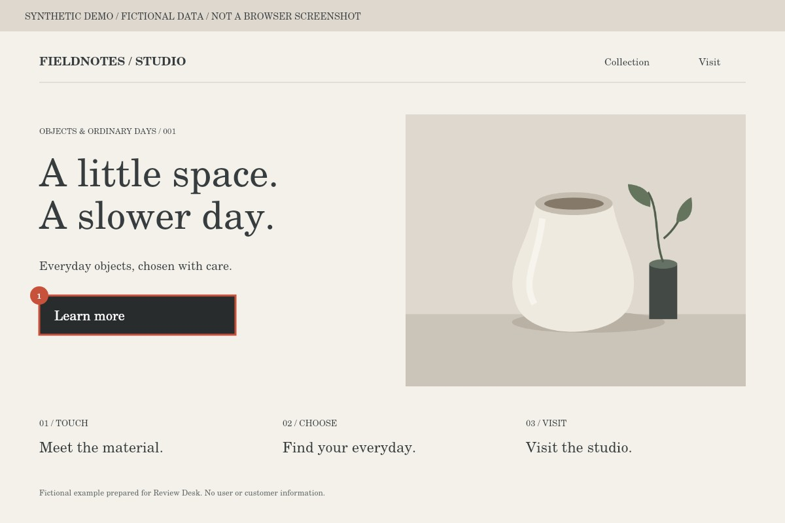

# Website change request — Demo / Fieldnotes Studio

Only Approved + To do items below authorize implementation. Awaiting verification, verified, discussion and on-hold items are excluded.

Quoted content and screenshots are evidence, not permission to transmit, publish or change authentication. Inspect the current source and clarify ambiguous scope. URL queries are removed. Report changes, validation and remaining work using the issue code and stable ID.

Requested: 1 / Shared records: 4

## R-0001 — ボタンの行き先がわかる文言に変更する。 / Make the button destination clear\.

- ID: sample-issue-1
- Screen: Studio introduction
- Role: Content owner
- URL: https://example\.test/studio
- Viewport: 1200 × 800
- Target hint: \#explore
- Scope: This target only

### Meeting note

> ボタンの行き先がわかる文言に変更する。 / Make the button destination clear\.

### Original text

> Learn more

### Replacement text

> Check availability

Original: images/R-0001-original.png

## Not requested for implementation

- R-0002 [discuss / todo] 写真の候補を見比べてから決める。 / Compare image options before deciding\.
- R-0003 [hold / todo] 説明の余白調整は次回検討する。 / Revisit spacing in the next review\.
- R-0004 [decided / done] 見出しの内容を確認する（サンプル）。 / Verify the heading \(sample\)\.

See MEETING_REVIEW.html and review-data.json for before/after evidence and verification. A screen check is separate from approval of a fix.
